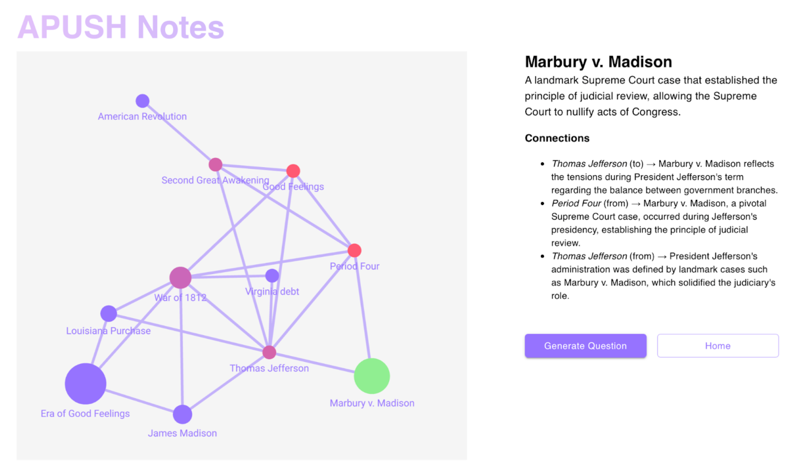
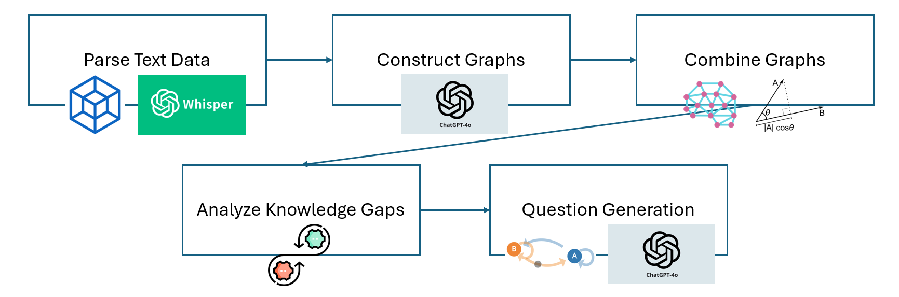

# Odin AI

In Norse mythology, Odin sacrificed his eye to see everything that happens in the world. In the same way, Odin AI superpowers your studies, providing visualization and analysis tools that ensure you never miss a topic again.



Odin constructs a knowledge graph from your notes and compares it to a knowledge graph constructed from lecture recordings. This allows easy identification of topics missing from your notes, as well as interactions between various concepts and themes. Based on your knowledge graph, Odin can also generate quiz questions at the frontier of your abilities, intended to maximize the efficiency of your study process.

## Getting started

1. Install dependencies in the project directory:

    ```
    npm install
    ```

2. Replace the placeholders in `keys.ts` with valid API keys.

3. Run the following to start the development server:

    ```
    npm run dev
    ```

4. Open a browser and go to `localhost:5173` to see the app!

5. Type `Ctrl+C` or `q` in the terminal with the server to stop the server.

## How Odin Works

Odin uses a combination of classic algorithms and modern AI techniques. A rough sketch of our pipeline is depicted below.


